# Realidade Virtual - Unidade 1  

Algumas anotações feitas na aula: [aulaAnotacoes.md](./aulaAnotacoes.md "aulaAnotacoes.md")  

## [atividadeAula.md](atividadeAula.md "atividadeAula.md")  

## Conteúdo

- Introdução a Realidade Virtual  
  - História, evolução e futuro  
  - Conceitos gerais  
  - Principais áreas da Realidade Virtual: Realidade Virtual Imersiva, Realidade Aumentada, Realidade Diminuída, Realidade Misturada, Realidade Alternativa e Metaverso  
  - Exemplos de aplicações de Realidade Virtual: conhecer conceitos gerais sobre Realidade Virtual  

## Objetivos

- conhecer estado atual e futuras projeções no uso de Realidade Virtual  
- entender a relação da área de Realidade Virtual com as outras áreas gráficas  
- explorar exemplos de aplicações de Realidade Virtual  

## Conceitos: Realidade Virtual (RV)

No momento atual muito se fala de Realidade Virtual, se divagando entre vários [Termos](#termos "Termos"), vendendo como algo novo e se fazendo promessas futuras ([História](#história "História")), e se misturando conceitos já solidificados na área (Tipos de [Realidades Virtuais](#tipos-de-realidades-virtuais "Realidades Virtuais") e de [Visualizações](#tipos-de-visualizações "Visualizações")). Então vamos passar por estes tópicos para entender um pouco este contexto que está na "modinha".  

### Termos

#### Imersão

Sentimento de estar-se dentro do ambiente.  

#### Interação

Está ligada com a capacidade do computador detectar as entradas do usuário e modificar “instantaneamente” o [mundo virtual](#mundo-virtual "mundo virtual") e as ações sobre ele.  

#### Envolvimento

Tange ao grau de motivação para conectar ("ligar") a pessoa com uma determinada atividade.  

#### Mundo Real

Mundo físico onde vivemos.  

#### Mundo Virtual

Mundo modelado virtualmente por modelos de computação gráfica que podem simular o [mundo real](#mundo-real "mundo real").  

#### Ancora RA

Forma de ancorar ("grudar") um objeto virtual ([mundo virtual](#mundo-virtual "mundo virtual")) em um objeto real ([mundo real](#mundo-real "mundo real")). Este processo pode ser com pré-calibragem, usando um marcador <!-- link marcador --> do mundo real, ou processado em tempo real usando objeto reais dinâmicos. É considerado um dos processos mais importante para aumentar a [imersão](#imersão "imersão") do usuário, fazendo ele acreditar que o objeto virtual realmente existe no [mundo real](#mundo-real "mundo real"). Além de garantir o posicionamento do objeto virtual no [mundo real](#mundo-real "mundo real"), que pode ser mais complicado com mudanças constantes de posicionamento dos objetos do [mundo real](#mundo-real "mundo real"), como também considerando a mudança do próprio observador. Ou ainda, aumentando mais a complexidade se for considerado as mudanças de iluminação, entre outros aspectos do [mundo real](#mundo-real "mundo real").

#### Credibilidade

O quanto algo pode ser considerado crível, quando algo virtual é apresentado com intenção de representar algo real ([Teste de Turing](https://pt.wikipedia.org/wiki/Teste_de_Turing "Teste Turing")).  

### História

Alguns pontos marcantes na história da Realidade Virtual: Sensorama, Helmet e Ivan Sutherland.  

**Sensorama** - espécie de cabine, que combinava filmes 3D, som estéreo, vibrações mecânicas, aromas, e ar movimentado por ventiladores. Patenteado em **1962** por Morton Heilig, o Sensorama já utilizava-se de um dispositivo para <!-- FIXME: link para explicação sobre visão estereoscópica --> visão estereoscópica.  
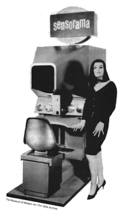  

Primeiro capacete de Realidade Virtual (Head Mounted Display - HMD) **Helmet** was made in **1967**.  
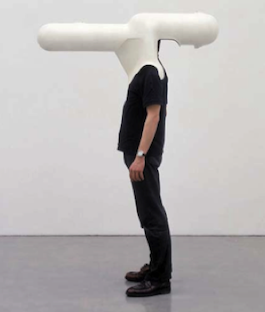  

Sistema criado por **Ivan Sutherland** no ano de 1968, como o objetivo de adicionar informações virtuais sobre os objetos reais, facilitando as tarefas do dia a dia (AZUMA, 1995, p. 1). Como outras tecnologias a Realidade Aumentada também teve um grande incentivo financeiro das Forças Armadas dos Estados Unidos da América (EUA), o estudo tinha foco na geração de informações gráficas interativas, assim como de imagens mais realistas e melhores sistemas de rastreamento (_tracking_) (EKENGREN, 2009, p. 5) (HÖLLERER; FEINER, 2004, p. 2).  
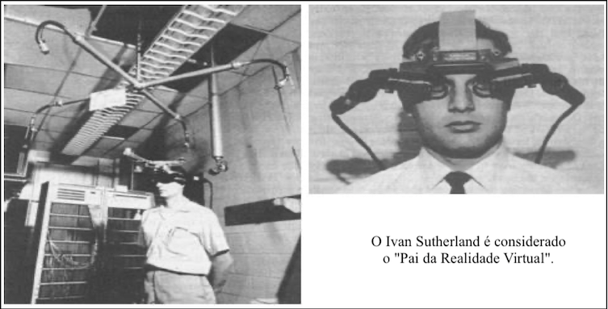  

Equipamento para Visão Estereoscópica <!-- FIXME: link para explicação sobre visão estereoscópica --> usado no Brasil na época colonial no **museu de Curitiba - PR**.  
[Museu Curitiba](./RealidadeVirtual_imgs/Estereoscopia_Museu_Curitiba.mp4 "Museu Curitiba")  
<video src="RealidadeVirtual_imgs/Estereoscopia_Museu_Curitiba.mp4" controls title="Estereoscopia_Museu_Curitiba"></video>

O conceito da **Realidade Aumentada** de sobreposição de objetos virtuais em objetos reais trazendo mais informações veio somente nos anos 90. No ano de 1993, foi criado o primeiro sistema móvel de Realidade Aumentada para ambientes externos utilizando as coordenadas do Sistema de Posicionamento Global (Global Positioning System - GPS) pelos pesquisadores da Universidade da Califórnia, para servir como assistente de navegação para deficientes visuais, colocando voz à imagem captada.

### Tipos de Realidades Virtuais

Uma forma de conceituar o que é Realidade Virtual e entender os tipos de realidades: Realidades Virtual (Imersiva), Realidades Virtual Aumentada, Realidades Virtual Diminuída, Realidades Virtual Misturada, Realidades Virtual Alternativa e Metaverso.

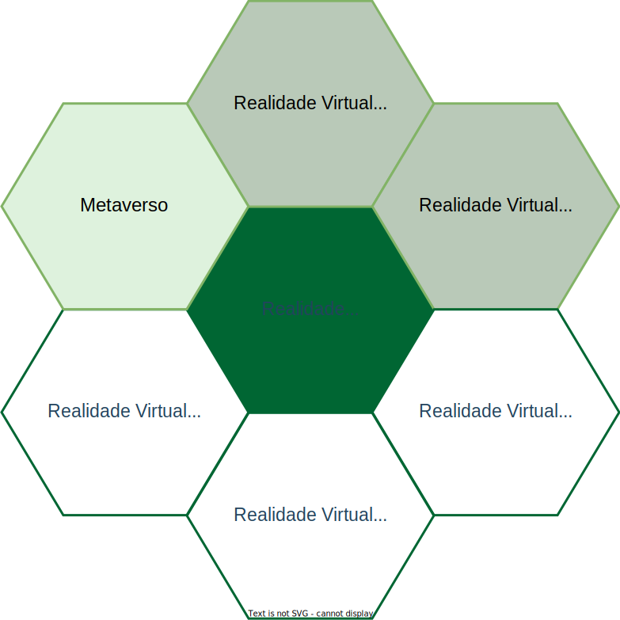  

#### Realidade Virtual Imersiva (RV / RVi)

A RV pode ser classificada conforme o nível de [interação](#interação "interação") do usuário com o sistema de RV, em **imersiva** e **não-imersiva**. É **imersiva** quando o usuário é transportado para o domínio da aplicação de RV, com a utilização de ferramentas que auxiliem na [imersão](#imersão "imersão"), como, por exemplo, capacete <!-- FIXME: link --> e luva <!-- FIXME: link --> para simulação de visão e tato, auxiliando a sensação de estar dentro de um [mundo virtual](#mundo-virtual "mundo virtual"). E é **não-imersiva** quando o usuário é transportado para o domínio da aplicação parcialmente, interagindo com um [mundo virtual](#mundo-virtual "mundo virtual") sem fazer parte dele, como, por exemplo, a utilização de monitor e projeção.  

Alguns pontos que devem ser observados para aumentar a [imersão](#imersão "imersão"):

- representar do [mundo virtual](#mundo-virtual "mundo virtual") que permita a [imersão](#imersão "imersão") do usuário (quanto mais crível melhor);  
- controlar os “sentidos” proporciona [imersão](#imersão "imersão") (mais comum: visão e tato);  
- poder interagir ou não com o que vê ao seu redor.

A Realidade Virtual Imersiva (RVi) procura trazer o usuário da aplicação para o ambiente virtual, já a Realidade Aumentada (RA), mantém o usuário no seu ambiente físico e transporta o ambiente virtual para o espaço do usuário, permitindo a [interação](#interação "interação") com o [mundo virtual](#mundo-virtual "mundo virtual"), de maneira mais natural e sem necessidade de treinamento ou adaptação.  

"Alucinação consensual" - William Gibson  
"Alguma coisa é real, estou vivendo em uma simulação, uma ilusão, uma realidade alternativa?" - David J. Chalmers  

Uma aplicação de RVi também é RV, mas uma aplicação de RV não é RVi.  

##### RV - Exemplos

Um exemplo de uso de RV é um usuário utilizando uma ferramenta de modelagem 3D (ex. Sketchup), e de RVi é quando o usuário coloca um HMD que "fecha" todo campo de visão do usuário, ou até mesmo "controlando" outros sentidos, e assim aumentando a [imersão](#imersão "imersão") deste usuário.  
<!-- FIXME: uma imagem para RV de acordo com o texto abaixo -->

A RVi explora o uso HMD para "controlar" o campo de visão do usuário ( 📢 ).  

[Usuário Imerso](./RealidadeVirtual_imgs/RVi_Usuario.mp4 "Usuário Imerso")  
<video src="RealidadeVirtual_imgs/RVi_Usuario.mp4" controls title="Usuário Imerso"></video>

Quanto mais controle dos sentidos, mais imersão, então se explora o uso de equipamentos para dar um retorno de Tato.  

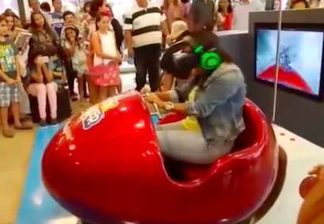  

#### Realidade Virtual Aumentada (RA)  

Uma aplicação de RA também é RV, mas uma aplicação de RV não é RA. Pois as aplicações que usam RA devem ter três características: combinar real com virtual, ter [interação](#interação "interação") em "tempo real" e usar o espaço 3D.  

Alguns pontos que devem ser observados:

- mistura do virtual com real;  
- único sentido: do virtual para real ou real para virtual (mais comum);  
- necessidade de marcadores <!-- FIXME: link --> (âncoras) no [mundo real](#mundo-real "mundo real");  
- ferramenta construtiva – adiciona elementos ao ambiente;  
- ferramenta destrutiva – mascara os elementos do ambiente.  

##### RA - Exemplos

<!-- TODO: diminuir tamanho do arquivo para ser exibido direto no Browser -->  
- [Mesa Tátil da TV Globo](./RealidadeVirtual_imgs/RA_MesaTatil.mp4 "Mesa Tátil da TV Globo")( 📢 ).  
<video src="RealidadeVirtual_imgs/RA_MesaTatil.mp4" controls title="RA_MesaTatil"></video>  
- [Painel de Fotos com Jogadores](./RealidadeVirtual_imgs/RA_Jogadores.mp4 "Painel de Fotos com Jogadores") ( 📢 ).  
<video src="RealidadeVirtual_imgs/RA_Jogadores.mp4" controls title="RA_Jogadores"></video>  
- [Rótulos de Garrafas](./RealidadeVirtual_imgs/RA_Garrafas.mp4 "Rótulos de Garrafas") ( 📢 ).  
<video src="RealidadeVirtual_imgs/RA_Garrafas.mp4" controls title="RA_Garrafas"></video>  
- [Le Petit Chef and Friends](./RealidadeVirtual_imgs/RA_LePetitChefAndFriends.mp4 "RA_LePetitChefAndFriends") ( 📢 ).  
<video src="RealidadeVirtual_imgs/RA_LePetitChefAndFriends_MM.mp4" controls title="LePetitChefAndFriends"></video>  

#### Realidade Virtual Diminuída  

Uma aplicação de RD também é RV, mas uma aplicação de RV não é RD. Nas aplicações de RD o principal objetivo é "Esconder" objetos no [mundo real](#mundo-real "mundo real") usando objetos do [mundo virtual](#mundo-virtual "mundo virtual"). Dois tipos de RD são:  

- _Observacional_ utiliza imagens pré-capturadas ou existentes do plano de fundo. Então, quando os novos elementos são adicionados em cena, as imagens de plano de fundo são utilizadas como referência para remover o objeto que “obstruiu” a imagem;  
- _In Painting_ tenta “pintar” os objetos indesejados utilizando texturas da imagem de origem.  

Alguns pontos que devem ser observados com a RD:

- utilizado normalmente em produções de vídeo/imagens, onde elementos não desejáveis precisam ser removidos;  
- pode permitir que o usuário remova objetos de vídeos em tempo real;  
- pode ser utilizado em conjunto com a realidade aumentada, para proporcionar uma
experiência de [imersão](#imersão "imersão") maior;  

##### RD - Exemplos

Remoção de objetos com um fundo complexo - [Chroma Key](https://pt.wikipedia.org/wiki/Chroma_key "Chroma Key") sem ter um fundo de cor fixa (ambiente estruturado).  
  

Remoção de objetos usando tablet em ambiente não estruturado.  
[Objetos Removidos - Tablet](./RealidadeVirtual_imgs/RD_Tablet.mp4 "Objetos Removidos - Tablet")  
<video src="RealidadeVirtual_imgs/RD_Tablet.mp4" controls title="RD_Tablet"></video>  

Remoção de objetos com seleção de região ([Region Of Interest - ROI](https://en.wikipedia.org/wiki/Region_of_interest "Region Of Interest - ROI")) em ambiente não estruturado.  
[Objetos Removidos Externo](./RealidadeVirtual_imgs/RD_Externo.mp4 "Objetos Removidos Externo")  
<video src="RealidadeVirtual_imgs/RD_Externo.mp4" controls title="RD_Externo"></video>  

#### Realidade Virtual Misturada

Mistura do virtual com real, e o real com o virtual, nos dois "sentidos".  

Alguns pontos que devem ser observados:  

- combina cenas do [mundo real](#mundo-real "mundo real") com o [mundo virtual](#mundo-virtual "mundo virtual"), e do virtual com o real;  
- permite [interação](#interação "interação") nos "dois" sentidos;  
- união de realidade aumentada e realidade virtual.  

Dependendo do cenário a ser aplicada a RM pode usar ("misturar") todas as outras Realidades Virtuais juntas.  

<!-- TODO: figura não aparece na Web qdo uso Areas.drawio.svg -->  
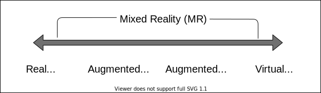  

A “misturara” geralmente é de imagens, mas pode ser de áudio, so informação, outros sentidos .. tato -> IUT

Para se pensar ...

    "A realidade misturada é o próximo ciclo na computação, seguida por mainframes, PCs e smartphones."  

[Exemplo usando o Apple Vision Pro na Fórmula 1](./RealidadeVirtual_imgs/RM_AppleVisionPro_F1.mp4 "RM_AppleVisionPro_F1") ( 📢 ).  
  
[Exemplo usando o Apple Vision na Medicina](./RealidadeVirtual_imgs/RM_AppleVisionPro_Medicina.mp4 "RM_AppleVisionPro_F1") ( 📢 ).  
<https://ocp.news/cotidiano/medico-de-jaragua-do-sul-com-1o-uso-de-applevisionpro-em-cirurgia-no-brasil>  
<video controls src="RealidadeVirtual_imgs/RM_AppleVisionPro_Medicina.mp4" title="Title"></video>

<video src="RealidadeVirtual_imgs/RM_AppleVisionPro_F1.mp4" controls title="Title"></video>  

##### RM - Exemplos

Material da Microsoft promovendo o uso do Hololens - Corpo Humano.  
[Corpo Humano](./RealidadeVirtual_imgs/RM_CorpoHololens.mp4 "Corpo Humano")  

Para saber mais [(05/04/2022) O que é realidade misturada?](https://docs.microsoft.com/pt-br/windows/mixed-reality/discover/mixed-reality "O que é realidade misturada?").  
<video src="RealidadeVirtual_imgs/RM_CorpoHololens.mp4" controls title="RM_CorpoHololens"></video>  
Hauntify - jogo de terror em VR que utiliza mapeamento da casa.  
<https://www.youtube.com/watch?v=I4StmcvXRh0>  
<video src="RealidadeVirtual_imgs/RM_Hauntify.mp4" controls title="RM_Hauntify"></video>

#### Realidade Virtual Alternativa  

Combinação de situações do virtual com o real.

Alguns pontos que devem ser observados:  

- transforma o [mundo real](#mundo-real "mundo real") em um cenário para a [interação](#interação "interação") do usuário;  
- incentiva que os usuários se "movimentem" no [mundo real](#mundo-real "mundo real") para interagir com os objetos virtuais no [mundo real](#mundo-real "mundo real").  

##### RAl - Exemplos

Um exemplo é o Pokemon Go que uns tempos atrás se torno uma "febre" onde se via pessoas explorando o [mundo real](#mundo-real "mundo real") em busca de "recompensas" do [mundo virtual](#mundo-virtual "mundo virtual"). A RAl pode promover além do entretenimento, outras funcionalidades, por exemplo, "construir algo" com o apoio do coletivo (gratuito). Um exemplo desta "construção" coletiva são as estatísticas de transito no Aplicativo de navegação [Waze](https://pt.wikipedia.org/wiki/Waze "Waze").  

- [Pokemon GO - Pokéball Plus](<https://www.youtube.com/watch?v=3UWnEo3A5fU> "Pokemon GO - Pokéball Plus")  

#### Metaverso  

Metaverso é a terminologia utilizada para indicar um tipo de [mundo virtual](#mundo-virtual "mundo virtual") que tenta replicar a realidade através de dispositivos digitais. É um espaço coletivo e virtual compartilhado, constituído pela soma de "realidade virtual", "realidade aumentada" e "Internet". Este termo foi utilizado pela **primeira vez em 1992**, e exemplos mais recentes são os jogos [VRChat](https://en.wikipedia.org/wiki/VRChat "VRChat"), [Second Life](https://pt.wikipedia.org/wiki/Second_Life "Second Life"), [Roblox](https://pt.wikipedia.org/wiki/Roblox "Roblox"), [Fortnite](https://pt.wikipedia.org/wiki/Fortnite "Fortnite"), [Facebook Meta](https://about.facebook.com/br/meta/ "Facebook Meta"), entre outros.  

[Second Life](https://pt.wikipedia.org/wiki/Second_Life "Second Life") é um **jogo de 2003** criado pela Linden Lab. O propósito do [Second Life](https://pt.wikipedia.org/wiki/Second_Life "Second Life") era de criar uma realidade paralela onde usuários poderiam jogar, socializar, trabalhar, comprar e vender propriedades, entre outras atividades. Houve muito interesse nos primeiros anos do jogo, com cobertura jornalística do Estadão no jogo, exposições do Itaú Cultural e apresentação de bandas.  

Acreditando que o Metaverso é o futuro da internet e tecnologia, Mark Zuckerberg, CEO do Facebook, **mudou em 2021** o nome de sua empresa para Meta Platforms Inc, ou Meta. Ele diz que a empresa irá abranger tudo o que eles acreditam, focando na construção do Metaverso. Bem como, outras grandes empresas seguem a mesma tendência. Por exemplo, a Apple ao anunciar o "SharePlay" na opção "Assistir Juntos", que permite ver filmes e séries nas chamadas FaceTime com seus amigos, permitindo uma conexão interativa em tempo real enquanto assistem ao mesmo conteúdo. Bem antes da Facebook se transformar em Empresa Meta, a Microsoft, Google e Apple já estavam fazendo sua "lição de casa" para também entrar no mercado das Realidades Virtuais e Metaverso. Por exemplo, em 2017 na [WorldWide Developers Conference (WWDC)](https://developer.apple.com/videos/wwdc2017/ "WorldWide Developers Conference (WWDC)") a Apple apresenta sua plataforma de RA (ARKit, desenvolvimento Nativo) e assumi o compromisso de ser a maior plataforma de RA do Mundo. Como também a Google vem com a plataforma ARCore (desenvolvimento Nativo), e a Microsoft já alguns anos no desenvolvimento do Hololens. Ou ainda opções de desenvolvimento Multiplataforma, como: [Vuforia](https://en.wikipedia.org/wiki/Vuforia_Augmented_Reality_SDK "Vuforia") ([Vuforia SDK](https://developer.vuforia.com)) e [Unity](https://unity.com "Unity") com o [AR Foundation](https://docs.unity3d.com/Packages/com.unity.xr.arfoundation@4.1/manual/index.html "AR Foundation").  

Usando iPad em jogo de RA registrando um [mundo virtual](#mundo-virtual "mundo virtual") no [mundo real](#mundo-real "mundo real") (mesa) permitindo a [interação](#interação "interação") entre dois jogadores.  
[MV Apple](RealidadeVirtual_imgs/MV_Apple.mp4 "MV Apple").  
<video src="RealidadeVirtual_imgs/MV_Apple.mp4" controls title="MV_Apple"></video>  

Equipe brasileira faz a primeira simulação de cirurgia no Metaverso ([https://globoplay.globo.com/v/10807963/](https://globoplay.globo.com/v/10807963/ "https://globoplay.globo.com/v/10807963/")).  
[MV Cirurgia Avatar](RealidadeVirtual_imgs/MV_CirugiaAvatar.mp4 "MV Cirurgia Avatar").  
<video src="RealidadeVirtual_imgs/MV_CirugiaAvatar.mp4" controls title="MV_CirugiaAvatar"></video>  

Oportunidade de Pesquisa - Simulação Virtual de Saúde - [E-Mail 2022-2](RealidadeVirtual_imgs/Bolsas__Fapesp_2022-2.pdf "E-Mail 2022-2")  

##### Metaverso - Para saber mais

- 09/02/2022: Os Metaversos e a transformação das Instituições Educacionais  
  - [Apresentação](https://youtu.be/PkWr7KhD44Q "Apresentação")  
  - [Material](https://3af732ee-100e-4457-9aaf-d3efd60d40f3.usrfiles.com/ugd/3af732_210b882240434c72ad66e42a30b9f28e.pdf "Material")  

- 17/12/2021: [Onde Você Vai Viver e Trabalhar em Breve](https://youtu.be/IqTC4lsxNfk "Onde Você Vai Viver e Trabalhar em Breve")  

##### Críticas e preocupações

A privacidade das informações no Metaverso é uma área de preocupação porque as empresas envolvidas provavelmente coletarão informações pessoais dos usuários por meio de dispositivos móveis, vestíveis e interações com os usuários. O Facebook está planejando persistir em publicidade direcionada dentro do Metaverso, levantando mais preocupações relacionadas à disseminação de desinformação e perda de privacidade pessoal.  
O vício do usuário e o uso problemático das mídias sociais são outra preocupação para o desenvolvimento do Metaverso. O transtorno do vício em Internet, mídia social e vício em videogame podem ter repercussões mentais e físicas por um período prolongado de tempo, como depressão, ansiedade e obesidade. Os especialistas também estão preocupados que o Metaverso possa ser usado como uma 'fuga' da realidade de uma forma semelhante às tecnologias existentes da Internet.  
O Metaverso pode ampliar os impactos sociais das câmaras de eco online e dos espaços alienantes digitalmente. Uma vez que os desenvolvimentos do Metaverso podem ser feitos para adaptar os mundos virtuais algoritmicamente com base nas crenças de cada pessoa. O Metaverso pode distorcer ainda mais as percepções dos usuários sobre a realidade com conteúdo tendencioso para manter ou aumentar o [envolvimento](#envolvimento "envolvimento").  

#### Interface de Usuário Tangível (IUT)

Um conjunto de componentes que auxiliam na [interação](#interação "interação") entre um humano e um computador de maneira tangível, ou seja, através do ambiente físico.  

Então, "como percebemos o mundo a nossa volta" ... qual "Interface" é utilizada?  
  

A IUT explora a relação entre as **camadas** Humano (usuário), Hardware e Software para permitir "manipular" a [Imersão](#imersão "imersão"), [Interação](#interação "interação") e [Envolvimento](#envolvimento "envolvimento") (os pilares das Realidades Virtuais) do usuário entre o [Mundo Real](#mundo-real "mundo real") e [Mundo Virtual](#mundo-virtual "mundo virtual"). A ideia de "manipular" a percepção dos sentidos é algo muito antigo, e essencial para maximar os pilares das Realidades.  

Uma macro visão deste processo de [Interação](#interação "Interação") usando a relação Homem x Hardware x Software pode ser observado neste diagrama abaixo.  
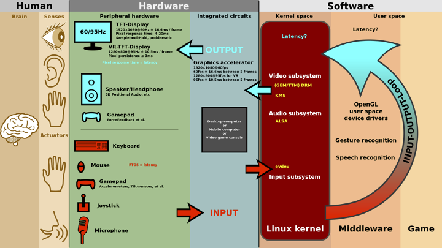  

Um exemplo de IUT seria no [Interactive Sonic Systems Team](https://file.org.br/artist/interactive-sonic-systems-team/).  
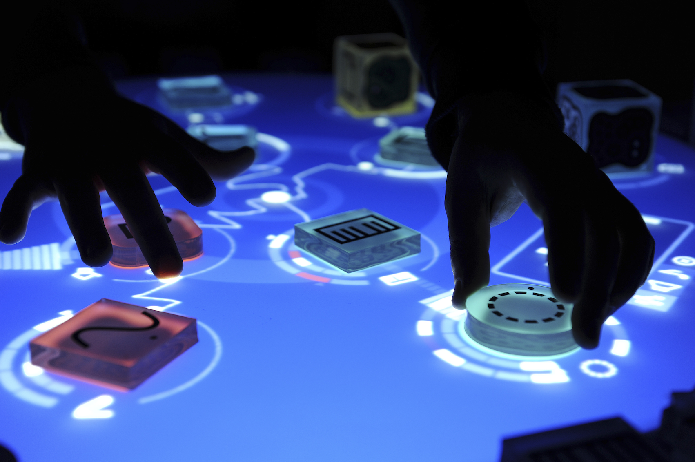  

#### Sensores e Atuadores

- Tipos: Ativos e Passivos  
- Ativos estão se transformando em passivos  
- Ajudam na ancoragem  

#### Estereoscopia

Como um dos principais sentidos explorado nas [Realidades Virtuais](#tipos-de-realidades-virtuais "Realidades Virtuais") é a visão, nos leva a alguns conceitos relacionados a este sentido. E principalmente para a [Realidade Virtual Imersiva - RVi](#realidade-virtual-imersiva-rv--rvi "Realidade Virtual Imersiva - RVi") se tem a Estereoscopia.

Estereoscopia é uma técnica usada para se obter informações do espaço tridimensional, através da análise de duas imagens obtidas em pontos diferentes.

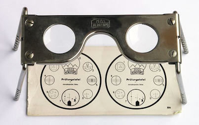  

A percepção de imagem estereoscópica pode ser obtida naturalmente através da disparidade na retina humana quando se olha para objetos reais do cotidiano. Ou imagens estéreo geradas por computador, em que a disparidade entre as imagens, é conhecida como paralaxe. O efeito paralaxe também pode ser reconstruído através de softwares 3D, como por exemplo o Blender, 3DSMax, Cinema4D ou Maya.

As vezes além do efeito Estereoscópio se usa alguns "truques" de Ilusão de Ótica.  
[Truques de Ilusão de Ótica](./RealidadeVirtual_imgs/Estereo_Taco.mp4 "Truques de Ilusão de Ótica")  
<video src="RealidadeVirtual_imgs/Estereo_Taco.mp4" controls title="Estereo_Taco"></video>
Alguns exemplos de videos com o efeito Estereoscópio podem ser vistos em: [Projeção 3D](../Unidade2/ExemplosHardware/ExemplosExternos/Projetor3D "Projeção 3D").  

Estes exemplos são considerados como Estereoscópica Ativa, pois precisam de equipamentos especiais para gerar o efeito Paralaxe.
Uma solução de muito mais baixo custo, mas com resultados mais simples são os considerados de Estereoscópica Passiva, como por exemplo os [Anaglifo](#anaglifo "Anaglifo").  

##### Anaglifo

Anáglifo é uma imagem (ou um vídeo) formatada de maneira especial para fornecer um efeito tridimensional estereoscópico quando visto com óculos de duas cores (cada lente com uma cor diferente). A imagem é formada por duas camadas de cor sobrepostas, mas com uma pequena distância entre as duas para produzir um efeito de profundidade, na mente de quem observa. O processo se dá quando as diferentes imagens são filtradas, uma para cada olho. Quando vista através de um filtro especial (no caso, os óculos), a imagem revela o efeito estereoscópico, parecendo "saltar" do plano em que estão (papel, TV, etc.).

Imagem representa o uso de dois padrões de cores para gerar o efeito [Anaglifo](#anaglifo "Anaglifo").  
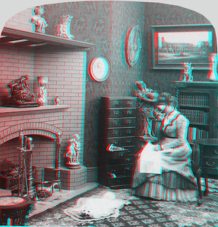  

O modelo mais "barato" de óculos que explora a Estereoscopia com o [Anaglifo](#anaglifo "Anaglifo").  
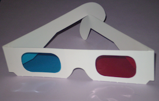  

### Tipos de Visualizações

<!--  FIXME: mais tipos, imagens para cada tipo. TCC do Evandro Schimit  -->
Também existe classificações para os tipos de visualizações usadas em RV: Video See-Through, Optical See-Through, Projetiva ... e outras.  

### SVR - Para saber mais

#### Symposium on Virtual and Augmented Reality - SVR

  Pre-Symposium (BR): <https://youtu.be/LU-LJUo6fyA>  
  Data: 07/11/2020  
  Formato: Remoto  
  Livro do Simpósio: [Introdução aos Conceitos de RV](./RealidadeVirtual_imgs/Conceitos-rv-ra.pdf "Introdução aos Conceitos de RV")  

| Assunto | Página |  
|---------|----:|  
| Capítulo 15 - Saúde | 316 |  
| 15.1 Introdução | 316 |  
| 15.2 Simulação Cirúrgica | 317 |  
| 15.2.1 Simulador de Cirurgia de Catarata | 318 |  
| 15.2.2 Simulador de videolaparoscopia | 320 |  
| 15.2.3 Considerações Finais | 323 |  
| 15.3 Treinamento virtual em saúde | 323 |  
| 15.3.1. Requisitos | 324 |  
| 15.3.2. Framework ViMeT (Virtual Medical Training) | 325 |  
| 15.3.3 Teste de aplicações de Realidade Virtual | 327 |  
| 15.4 Explorando técnicas de Inteligência Artificial em Ambientes Virtuais para Reabilitação Cognitiva | 330 |  
| 15.5 Ensino, Avaliação e Ferramentas para RV em Saúde | 334 |  
| 15.5.1. Aplicações Voltadas ao Ensino e à Reabilitação | 334 |  
| 15.5.2 Avaliação Automática de Habilidades | 336 |  
| 15.6 Ambientes Virtuais Tridimensionais Aplicados como Brinquedo Terapêutico | 340 |  
| 15.7 Uso da Realidade Virtual na Psicoterapia | 347 |  
| 15.8 Tendências e oportunidades | 350 |  
| Referências | 351 |  

- 00:00:00 [Abertura do Evento](<https://youtu.be/LU-LJUo6fyA> "Abertura do Evento")  
- 00:12:56 [Conceitos sobre RV e RA (Romeu Tori)](<https://youtu.be/LU-LJUo6fyA?t=772> "Conceitos sobre RV e RA (Romeu Tori)")  
- 00:34:26 [Aplicações de RV e RA em Saúde](<https://youtu.be/LU-LJUo6fyA?t=2066> "Aplicações de RV e RA em Saúde")  
- 00:56:31 [Perguntas e Respostas](<https://youtu.be/LU-LJUo6fyA?t=3392> "Perguntas e Respostas")  
- 01:13:42 SVR | Break
- 01:30:17 [Deep Reinforcement Learning em Ambientes Virtuais](<https://youtu.be/LU-LJUo6fyA?t=5417> "Deep Reinforcement Learning em Ambientes Virtuais")  
- 01:53:28 [Ecossistema XR no Brasil: desafios, oportunidades, ameaças e perspectivas](<https://youtu.be/LU-LJUo6fyA?t=6808> "Ecossistema XR no Brasil: desafios, oportunidades, ameaças e perspectivas")  
- 02:12:00 [Realidade Estendida em Treinamentos Corporativos](<https://youtu.be/LU-LJUo6fyA?t=7920> "Realidade Estendida em Treinamentos Corporativos")  
- 02:23:00 [Perguntas e Respostas](<https://youtu.be/LU-LJUo6fyA?t=8583> "Perguntas e Respostas")  
- 02:44:00 Encerramento

#### Virtual Reality Lab - EPFL

[https://archiveweb.epfl.ch/vrlab.epfl.ch/](https://archiveweb.epfl.ch/vrlab.epfl.ch/)  

#### Mais exemplos

[Outros Exemplos](ExemplosSoftware/ "Outros Exemplos")  

----------

## ⏭ [Unidade 2](../Unidade2/README.md "Unidade 2")  

<!--
TODO: arrumar as fontes bibliográficas]  
## Principais Referências Bibliográficas​
-->