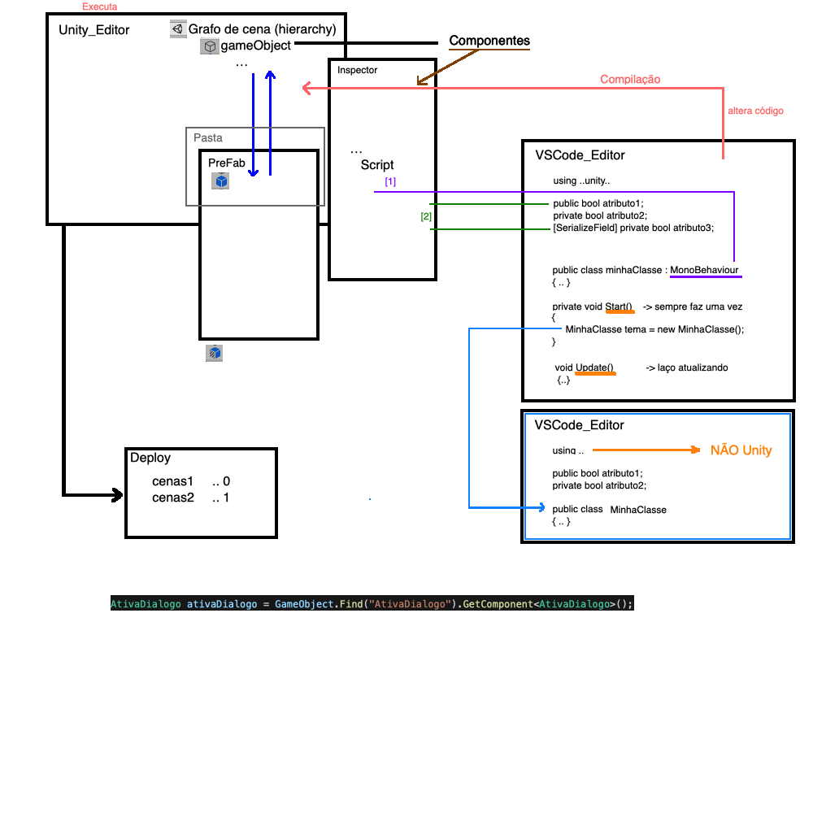

# Unity

## Página da Unity

<http://unity.com>

Era Unity3D, agora só Unity (não tinha parte 2D).

## Downloads: Unity Hub

- Recomendações (ATENÇÃO)
  - preferir versões LTS (Long Time Support)
  - não mudar de versão durante o desenvolvimento do Projeto
  - todos da equipe terem a mesma versão

**ATENÇÃO** usar a versão 2022.3.1f1  

## Editor

- pastas salvar: Assets / Packages / ProjectSettings
  - pasta com os deploy (Android/iOs/Windows)
- evitem fazer coisas "fora" do editor do Unity
- sempre testem aonde irão usar (plataforma)
- [Manual/UnityHotkeys](<https://docs.unity3d.com/Manual/UnityHotkeys.html>)
  - [Unity_HotKeys_Mac](./Unity_HotKeys_Mac.pdf)
- [SceneViewNavigation](<https://docs.unity3d.com/Manual/SceneViewNavigation.html>)
- Project
- Package/Assets
- Scene
  - GameObject
    - Components
- Windows / Package Manager
- [PositioningGameObjects](<https://docs.unity3d.com/Manual/PositioningGameObjects.html>)

## Entendo um pouco o Unity (boa sorte ...)

Para ter uma visão geral do Unity veja a imagem abaixo:

E assista o vídeo em (2020-2): <https://web.microsoftstream.com/video/5c163263-3938-464d-a10a-efc82fbab600>  
E assista o vídeo em (2021-1): <https://furb.sharepoint.com/teams/CMP0154030120211/Documentos%20Compartilhados/General/Recordings/AulaRV%20(G-206)-20210414_183133-Grava%C3%A7%C3%A3o%20de%20Reuni%C3%A3o.mp4?web=1>

## Ponto positivos

- Forte para jogo
- Forte para fazer deploy multiplataforma
- Unity3D -> Unity
- sempre sendo atualizado
- integração com RA:
  - RV, RVI, RA, RM, RA ...

## Pontos negativos

- gerador de código (parcial)
- código "inchado"
- pedaços de Assets desnecessários dentro do projeto (Hunter Pro)
- nem sempre o refactor para novas versões funciona bem

## Boas Práticas em Unity

- [Unity_BoaPraticas_2018-2](./Unity_BoaPraticas_2018-2.pdf)

## Documentação

<https://docs.unity3d.com/ScriptReference/>

## Unity (camadas)

- UnityEditor (IDE)
- UnityEngine (SDK)

## Dores de cabeça

- janelas "perdidas", as vezes parece que o Unity "travou", mas não ...

### Conceito de Programação

- Gráfico
- Paradigma Componentes
- Linguagem C# Unity
- Linguagem C# Orientado a Objetos
- Assets
- Package
- PreFab

## Estrutura de pastas no Projeto

- o que deve ser ignorado no .gitignore
- [github template](https://github.com/github/gitignore)
  - [Unity.gitignore](https://github.com/github/gitignore/blob/master/Unity.gitignore)

## IDE código

### VSCode

- extensões
  - Debugger: <https://marketplace.visualstudio.com/items?itemName=Unity.unity-debug>
  - <https://marketplace.visualstudio.com/items?itemName=Tobiah.unity-tools>
  - <https://marketplace.visualstudio.com/items?itemName=kleber-swf.unity-code-snippets>

## Linguagem de Programação (C#)

- conhecer C#
- private / protect / public
- código desacoplado do Unity ..
- Scripts
  - [Funções](<https://docs.unity3d.com/ScriptReference/MonoBehaviour.html>)

## Exemplos

### [01_OlaMundo](2021.3.19f1/01_OlaMundo)

### Exemplo: Plano + Cubo (mover)

- nova cena "padrão"
- adicionar um plano
- adicionar um cubo
- ajustar o cubo para fica com a base adjacente ao plano
- .. play
- selecionar cubo
- criar um script Cubo
- editar Cubo.cs no VSCode - Update()
  - [Transform-position](<https://docs.unity3d.com/ScriptReference/Transform-position.html>)
  - Debug.Log(transform.position)

## Debug

## Emulador (device)

- Android [Unity Remote 5](<https://play.google.com/store/apps/details?id=com.unity3d.mobileremote>)
- [Unity Reflect](<https://play.google.com/store/apps/details?id=com.Unity.Reflect.Viewer>)
- [Reflect](<https://unity.com/products/unity-reflect>)

## Assets

- [AssetStore](<https://assetstore.unity.com>)
- Hunter Pro

## VR->RA

<https://developer.vuforia.com>

- Android ARCore
- Apple AR Kit
- ARFundation
- funções
  - Extend Tracking
